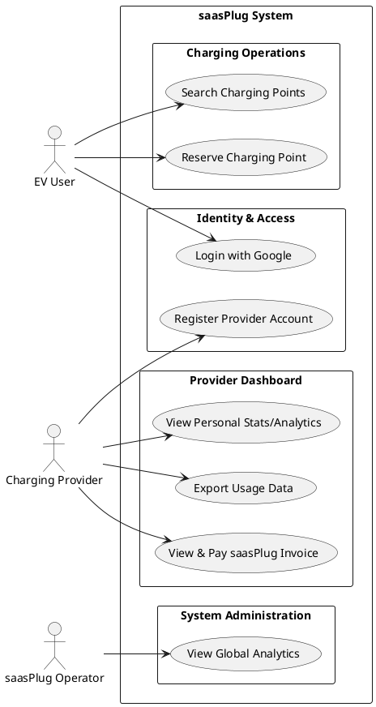
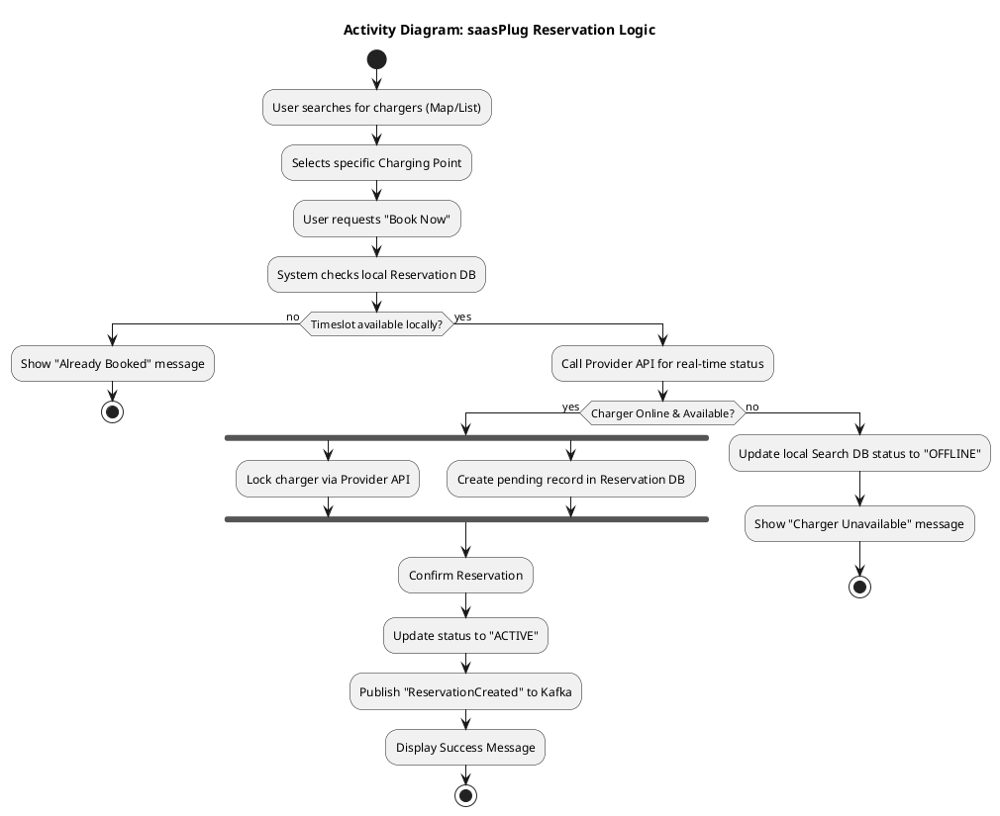
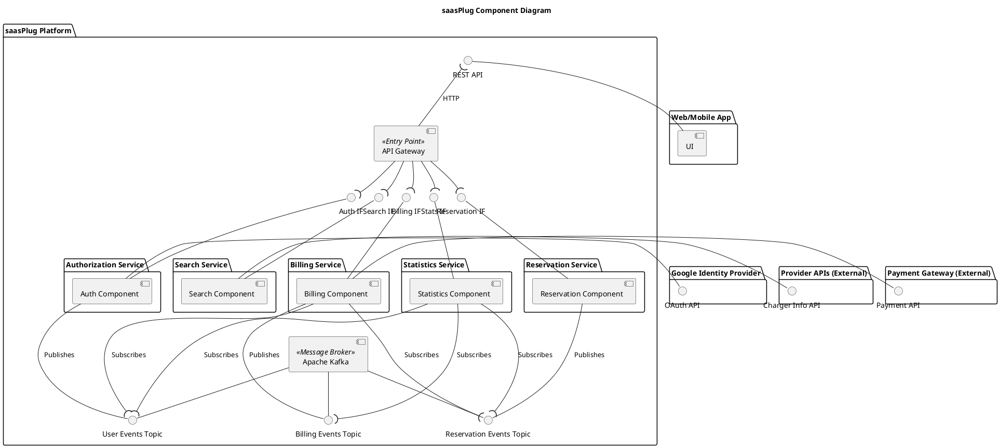
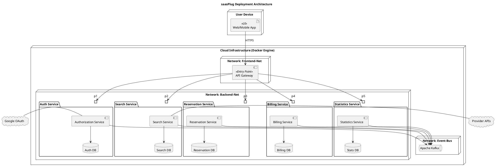
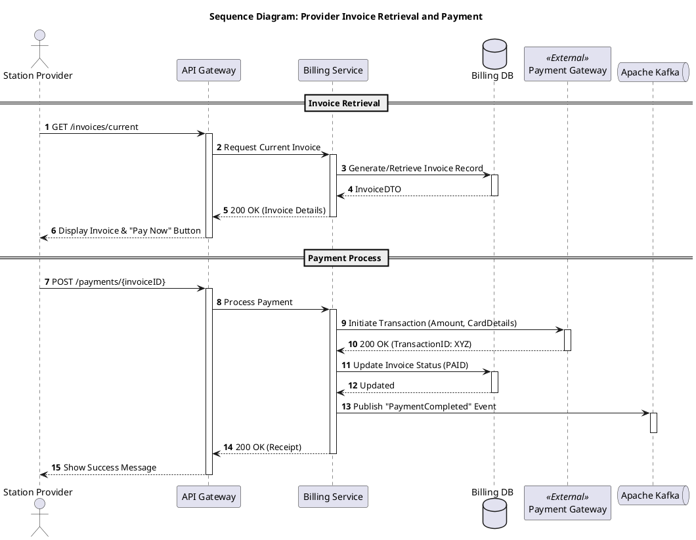
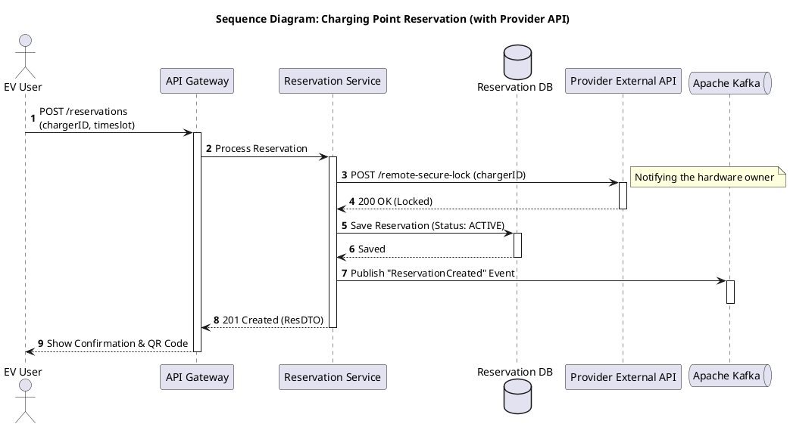

# Software Requirements Specification (SRS)

# saasPlug Application

---

## 1. Introduction

### 1.1 Purpose  
The saasPlug Application is a web-based service that allows EV users to find and book chargers from any provider.

### 1.2 Scope  
This application allows users to: 
-Login with Google
- Search the avaliable charging points  
- Book the charging point they want  
- Register for charging providers   
- View analytics of provider
- View saasPlug usage invoice for providers
- View global statistics / analytics from the saasPlug operator 

### 1.3 Definitions, Acronyms, and Abbreviations  
- **EV**: Electric Vehicle.  
  
### 1.4 Overview  
This document outlines functional and non-functional requirements, use cases, and interface specifications for the saasPlug Application.

---

## 2. System Overview

### 2.1 Product Perspective  
SaasPlug is a SaaS (Software as a Service) standalone web application. It uses a database  for user and analytics storage.

### 2.2 Product Functions 
1. Login user with Google.
2. Search fot the avaliable charging points.  
3. Booking the charging point of user preference.  
4. Registration for charging providers.  
5. Display analytics for each provider.  
6. Display saasPlug usage invoice for providers.  
7. Display global statistics / analytics from the saasPlug operator  

### 2.3 User Characteristics  
Primary users include electric vehicle users who need a simple app to find a charging point near them and also charging providers looking for customers . No coding or technical skills are required.

### 2.4 Operating Environment  
- **Frontend**: Modern browsers (Chrome, Firefox, Safari).   
- **Backend**: Server with Node.js,Python and React. 
- **Database**: Docker Containers.  
- **Network**: Internet connectivity required for backend-database communication.  

### 2.5 Assumptions and Dependencies  
- Google OAuth is available for user authentication.

---

## 3. Use cases

### 3.1 Use Case Diagram  


### 3.2 Use Cases Activity Diagrams

### 3.2.1 Login with Google

- **Activity Diagram**:

  ```plantuml
    @startuml activity_register
    title Activity Diagram: saasPlug Registration & Onboarding

    start
    :User clicks "Login/Sign up with Google";
    :Redirect to Google OAuth;

    if (Google Authentication Successful?) then (yes)
        :Receive Google Identity Token;
        :Auth Service checks if User exists in DB;
  
        if (User already exists?) then (no)
            :Create new User Profile;
            :Assign default Role (EV_USER);
            :Publish "UserRegistered" to Kafka;
        else (yes)
            :Retrieve existing Profile;
        endif

        :Display Home Dashboard;
  
        if (User wants to register as Provider?) then (yes)
            :User selects "Become a Provider";
            :Display Provider Registration Form;
            :User enters Company Details & API Endpoint;
    
            if (Validate Business Info?) then (success)
                :Update User Role to PROVIDER;
                :Create Provider Profile;
                :Link Charger API Endpoint to Account;
                :Publish "ProviderOnboarded" to Kafka;
                :Show Provider Dashboard;
            else (failure)
                :Show Validation Errors;
                stop
            endif
        else (no)
            :Continue as EV User;
            :Show Map/Search Interface;
        endif

        stop
    else (no)
    :Display Auth Error Message;
    stop
    endif

    @enduml
  ```

  ### 3.2.2 Resarvation for Charging

  - **Activity Diagram**:



## 5. Component Diagram 



## 6.Deployment



## 7.Sequence Diagram 

### 7.1 Payment 



### 7.2 Resevation


